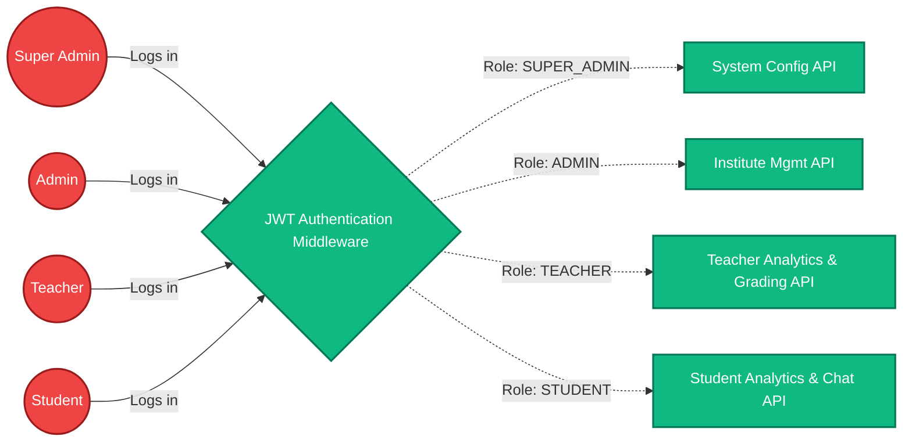

# StudentOS Architecture & Workflow

Here are visual representations of the StudentOS architecture and the Retrieval-Augmented Generation (RAG) workflow to include in your presentation or documentation.

## 1. High-Level System Architecture

This diagram shows the decoupled client-server architecture, highlighting the specific technologies used at each layer.

```mermaid
graph TD
    %% Define styles
    classDef frontend fill:#3b82f6,stroke:#1d4ed8,stroke-width:2px,color:white;
    classDef backend fill:#10b981,stroke:#047857,stroke-width:2px,color:white;
    classDef db fill:#f59e0b,stroke:#b45309,stroke-width:2px,color:white;
    classDef external fill:#8b5cf6,stroke:#5b21b6,stroke-width:2px,color:white;

    %% Nodes
    subgraph "Client Side (Frontend)"
        UI["React 19 UI\n(Tailwind CSS, shadcn/ui)"]:::frontend
        Router["TanStack Router\n(Routing)"]:::frontend
        State["TanStack Query\n(Data Fetching & Caching)"]:::frontend
    end

    subgraph "Server Side (Backend)"
        API["FastAPI\n(REST API Endpoints)"]:::backend
        Auth["JWT Authentication\n(Role-based Access)"]:::backend
        ORM["SQLAlchemy 2 & Alembic\n(Data Modeling)"]:::backend
        RAG["RAG Service\n(Vector Search)"]:::backend
    end

    subgraph "Data Persistence"
        PG[(PostgreSQL\nRelational Data\n& pgvector)]:::db
    end

    subgraph "External AI Provider"
        Groq["Groq API\n(LLM Generation)"]:::external
    end

    %% Connections
    UI <-->|User Actions / Render| Router
    Router <-->|Route Data| State
    
    State <-->|HTTP / JSON Requests\n(JWT in Header)| API
    
    API --- Auth
    API --- ORM
    API --- RAG
    
    ORM <-->|SQL Queries| PG
    RAG <-->|Cosine Similarity Search| PG
    RAG <-->|Context + Prompt| Groq
```

## 2. RAG (Retrieval-Augmented Generation) Workflow

This diagram illustrates the step-by-step process of how the AI Study Assistant works, from a teacher uploading a note to the student receiving an answer.

```mermaid
sequenceDiagram
    autonumber
    
    actor Teacher
    actor Student
    participant Frontend as React Dashboard
    participant Backend as FastAPI Server
    participant DB as PostgreSQL Database
    participant Groq as Groq LLM API

    %% Knowledge Base Population Phase
    rect rgb(30, 41, 59)
    note right of Teacher: Phase 1: Knowledge Ingestion
    Teacher->>Frontend: Uploads Study Notes PDF/Text
    Frontend->>Backend: POST /api/v1/notes (JWT token)
    Backend->>Backend: Splits text into small chunks
    Backend->>Backend: Generates Vector Embeddings
    Backend->>DB: Stores Note & Embedded Chunks
    DB-->>Backend: Save Success
    Backend-->>Frontend: Success Response
    end

    %% Query Phase
    rect rgb(15, 23, 42)
    note right of Student: Phase 2: AI Query & Retrieval
    Student->>Frontend: Asks question: "What is CNN?"
    Frontend->>Backend: POST /api/v1/assistant/chat
    Backend->>Backend: Embeds student's question
    Backend->>DB: Cosine Similarity Search (Vector Match)
    DB-->>Backend: Returns Top 3 relevant Note Chunks
    Backend->>Backend: Constructs Prompt combining chunks + question
    Backend->>Groq: Sends augmented prompt to LLM
    Groq-->>Backend: Generates contextual answer
    Backend->>DB: Saves chat history message
    Backend-->>Frontend: Streams Answer to UI
    Frontend-->>Student: Displays AI Response
    end
```



## 3. Role-Based Access Control (RBAC) Flow

This diagram shows how the system securely separates data based on the user's role using JWT tokens.


